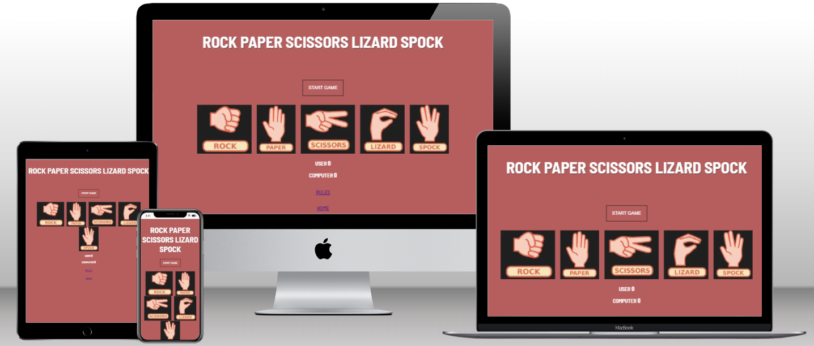
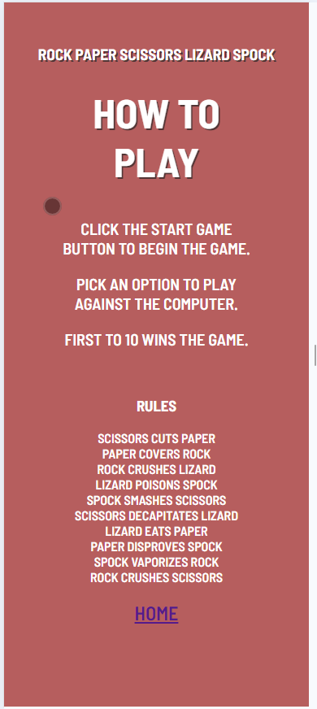
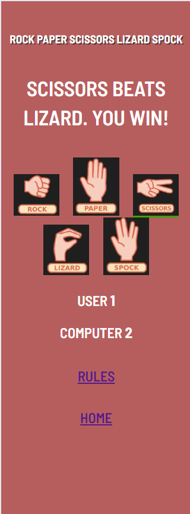
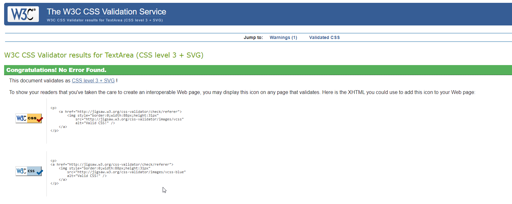

# Rock, Paper, Scissors, Lizard, Spock

Rock, Paper, Scissors, Lizard, Spock is a twist on the classic hand gesture game from the TV series The Big Bang Theory. The website provides a interactive version of the game where the user will play against the computer with the winning score being first to 10.
The game can be played on any device.

Multi device image

Link to the website https://paulmayock.github.io/rock-paper-scissors-lizard-spock/

## User Experience
The target market for this website includes users who want to play the updated version from the TV series The Big Bang Theory or those who already enjoy the Rock, Paper, Scissors game.
The user goals are as follows:
- As a user I want to play the game as described in the TV show
- As a user I want the game to show what the rules are especially for first time users.
- As a user I want the game to show who won each round against the computer.
- As a user I want the game to tally the total scores to show who won.

## Design

### Wireframe

 - Home page 

 - Start game

 

 - Rules page

 

 - Choice option

 

 - Winning choice

 

 - Losing choice

 

 - Equal choice

 

 - You win

 - You lose

### Mobile View

 - Home page

 - Rules

 - Game screen

### Color

For the main body color a red plaster color was choose the text color was white with a hint of black shadow for the heading. The hover color for the start button updates to a richer red color while for the rules and home page button a white highlight was choose. When the user hovers over each option a green glow will surround the option. When the player chooses an option which beats the computer the option will give another green glow on the border for the winning option. When the player chooses an option which is beaten by the computer the option glows red on the border. When the user and computer choose the sam option the the option gives a yellow border glow to show it is a draw.

### Fonts

The main font used was a Barlow Semi Condensed with sans-serif.

## Features

The home page consists on the start button which must be pressed to start the game. It also shows the options to to choose when playing the games and there is a link at the bottom of the page when clicked on brings you to the rules.

The rules page shows the user how to play the game and the rules to the game. The rules outlines which options beats which option.

The start button when clicked on starts the game. The game cannot be started until this button is clicked. The button disappears once clicked.

When the user chooses a winning option the option glows a green border for a split second with the message stating the option beats the losing option, you win.

When the user chooses a losing option the option gives a red border glow for a split second with the message stating the option, you lose.

When the user chooses a option which matches the computer the option chosen gives a yellow border glow for a split second stating option equals option, it's a draw.

When the user gets to 10 wins the user wins the game with the response Game over, You win and gives the option to start a new game.

When the user loses the game and the computer gets to 10 wins first the response given is game over, you loose and gives the option to start a new game.

## Technologies used

### Coding languages

HTML, CSS, Java-script.

### External resource

Google Fonts: “Barlow Semi Condensed with sans-serif” imported externally into the CSS file. 

Am I Responsive?: Used to test out how friendly the site is across various screen sizes. The responsive nature of the site is shown at the top of this document in the mock-up.

Git-Hub / Code Anywhere / Visual Code Studio: Git-hub is used to store the project files and is used to host the site. Code Anywhere and Visual code were used as the IDE to code the website.

Google Web Developer Tools: Google Chrome was used as the browser for the development of this website game. The inbuilt Developer Tools were used to understand the HTML, CSS and Java Script workings in real-time.

https://techsini.com/multi-mockup/index.php 

Used to create a multi device user image which you can see at the start of the readme.

https://openclipart.org/detail/325665/rock-paper-scissors-lizard-spock 

Used to create the images of each option for the game.

https://www.wikihow.com/Play-Rock-Paper-Scissors-Lizard-Spock

Used to explain the rules of the game

https://validator.w3.org/nu/#textarea

Used to validate HTML

https://jigsaw.w3.org/css-validator/validator

Used to validate CSS

http://jshint.com/

Used to validate Javascript

## Validator testing

- HTML

No errors were returned when passing through W3C validator. The rules page did show 2 warnings but I was aware of these and wanted to keep the HTML on this page as is.

- CSS

No errors were received when passing the CSS through CSS validator

- Javascipt

No errors were returned when passing through JShint validator. Warnings are currently present, however these are regarding ES6 Compatibility; I'm aware of these and I am satisfied these can be dismissed.

- Accessibilty

Lighthouse was used to test this and confirm colors and fonts are easily read.

## Testing

Testing was carried out on the website to ensure correct functionality.

### How to play the game and rules:

The home screen shows the start button and the options to choose when playing the game.

Below the options are the user score and computer score.

Below the score is a link for the rules and home page. When the user click the rules page the page brings you to another page showing how to play and the rules.

At the bottom of the rules page is a home button to bring you back to the home page.

When the user click the start button on the home page the game begins with the message above the option to choose your weapon.

When the user clicks an option the game calculates if your option beats the computer option. If your option beats the computer option the message shows for example "Scissors beats paper. You Win!".

The winning option also gives a green glow on the border for easy visual to show your option won. 

If your option loses to the computer option the message shows for example "Scissors beats paper. You lose". The losing option also gives a red glow on the border for easy visual to show your option lost. If your option is equal to the computer option the message shows for example "Scissors equals scissors. It's a draw". The equal option also gives a yellow glow on the border for easy visual to show your option equals the computer.

The first to 10 wins. If the user wins a message will show "Game over! you win!. If the user loses a message will show "Game over! you lose A selection box will show to give the user the option to start a new game. When the user clicks on the new game button a new game will begin.

### Manual testing

## Bugs

After codeanywhere had issues for a number of days I decided to use visual code for writing up the code for the project. When copying the file paths for images the slash was incorrect as it would copy a backslash instead of a forward slash. Due to this the images would not display correctly when the website was live. After some research I found this issue and corrected it.

## Improvements

Some improvements I would have liked to make to the website.

- Option to end the game while playing the game
- Option to quit the game when the game has ended instead of only the option to start new game.

## Deployment

This project was deployed using Visual code and updated were committed to Github to keep track of changes. The website is deployed using Github pages.

### Deploy from Github

- Log into your GitHub repository
- Click 'Settings' in the main Repository menu
- Click 'Pages' from the left-hand side navigation menu
- click the "Branch" button and change from 'None' to 'Main'
- The page should automatically refresh with a url displayed
- Test the link by clicking on the url

## Credit

- Code Institute's love maths was used for revision of how to write javascript for my project.
- Thank you to my mentor for the assistance given.
- Thank you to my partner for the many hours of patience and support.
