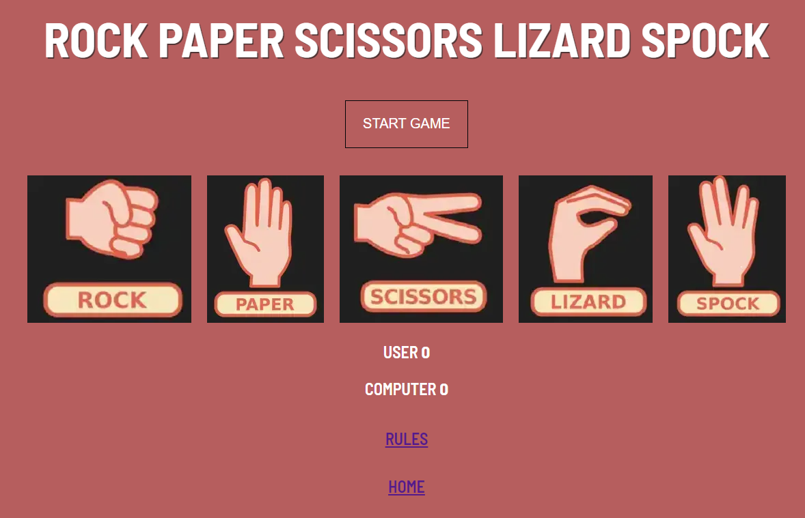

# Rock, Paper, Scissors, Lizard, Spock

Rock, Paper, Scissors, Lizard, Spock is a twist on the classic hand gesture game from the TV series The Big Bang Theory. The website provides a interactive version of the game where the user will play against the computer with the winning score being first to 10.
The game can be played on any device.

Multi device image

Link to the website https://paulmayock.github.io/rock-paper-scissors-lizard-spock/

## User Experience
The target market for this website includes users who want to play the updated version from the TV series The Big Bang Theory or those who already enjoy the Rock, Paper, Scissors game.
The user goals are as follows:
- As a user I want to play the game as described in the TV show
- As a user I want the game to show what the rules are especially for first time users.
- As a user I want the game to show who won each round against the computer.
- As a user I want the game to tally the total scores to show who won.

## Design
 - Home page 

 - Rules page

 

 - Start button hover

 

 - Choice option

 

 - Winning choice

 

 - Losing choice

 

 - Equal choice

 

 - Start hover

 

 - New game

 

### Color

For the main body color a red plaster color was choose the text color was white with a hint of black shadow for the heading. The hover color for the start button updates to a richer red color while for the rules and home page button a white highlight was choose. When the user hovers over each option a green glow will surround the option. When the player chooses an option which beats the computer the option will give another green glow on the border for the winning option. When the player chooses an option which is beaten by the computer the option glows red on the border. When the user and computer choose the sam option the the option gives a yellow border glow to show it is a draw.

### Fonts

The main font used was a Barlow Semi Condensed with sans-serif.

## Features

The home page consists on the start button which must be pressed to start the game. It also shows the options to to choose when playing the games and there is a link at the bottom of the page when clicked on brings you to the rules.

The rules page shows the user how to play the game and the rules to the game. The rules outlines which options beats which option.

The start button when clicked on starts the game. The game cannot be started until this button is clicked. The button disappears once clicked.

When the user chooses a winning option the option glows a green border for a split second with the message stating the option beats the losing option, you win.

When the user chooses a losing option the option gives a red border glow for a split second with the message stating the option, you lose.

When the user chooses a option which matches the computer the option chosen gives a yellow border glow for a split second stating option equals option, it's a draw.

When the user gets to 10 wins the user wins the game with the response Game over, You win and gives the option to start a new game.

When the user loses the game and the computer gets to 10 wins first the response given is game over, you loose and gives the option to start a new game.

## Technologies used

### Coding languages

HTML, CSS, Java-script.

### External resource

Google Fonts: “Barlow Semi Condensed with sans-serif” imported externally into the CSS file. 

Am I Responsive?: Used to test out how friendly the site is across various screen sizes. The responsive nature of the site is shown at the top of this document in the mock-up.

Git-Hub / Code Anywhere / Visual Code Studio: Git-hub is used to store the project files and is used to host the site. Code Anywhere and Visual code were used as the IDE to code the website.

Google Web Developer Tools: Google Chrome was used as the browser for the development of this website game. The inbuilt Developer Tools were used to understand the HTML, CSS and Java Script workings in real-time.